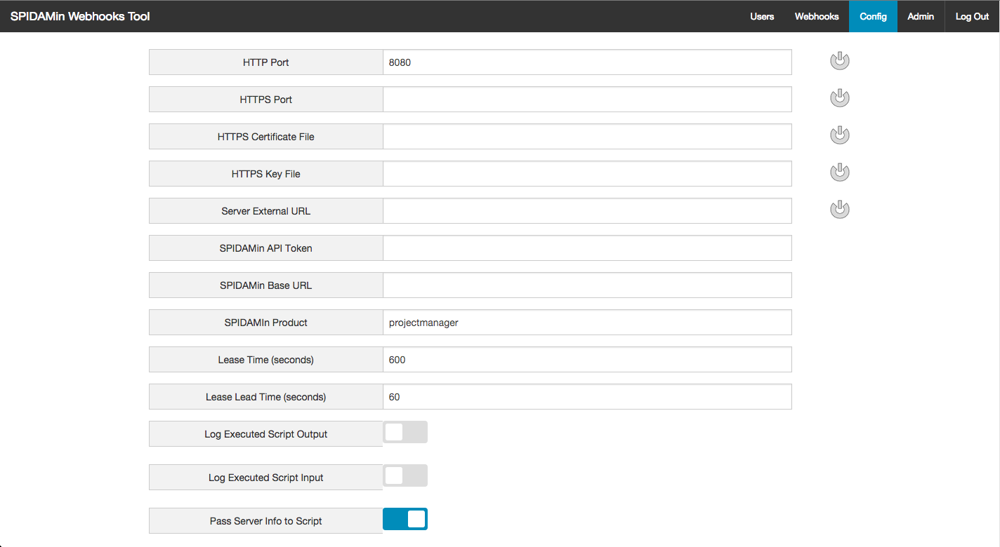

# Webhooks Tool

[](https://travis-ci.org/spidasoftware/webhooks-tool)

The SPIDAMin Webhooks Tool can be used to trigger scripts to run based on SPIDAMin events.  This application will connect to a running SPIDAMin application using the Webhook API.  It will maintain a set of active webhooks, and trigger scripts whenever a webhook callback is received.

See the [SPIDAMin WebhookAPI Documentation](https://github.com/spidasoftware/schema/blob/master/doc/apis/webhookAPI.md) for more information on using webhooks with SPIDAMin.

**Note:** If Min becomes unavailable, the webhooks tool will need to be resynced with min to ensure that all webhooks are registered with min.  Please click the resync button on the admin page to do this.

## Installation

### Prerequisites

The following prerequisites are needed to run the Webhooks Tool.  

* [Supervisor](http://supervisord.org)
* [Node.js](http://nodejs.org/)

### Deployment

For Debian-based (Debian, Ubuntu, Mint, etc.) (recommended)
* `sudo apt-get install --yes nodejs-legacy supervisor`
* `cd where-you-want-it-installed`
* `sudo tar xfv webhooksTool.x.y.z.tar.gz`
* `sudo webhooks-tool/install.sh`

For Redhat-based (RHEL, CentOS, Fedora, etc.)
* `sudo yum install -y epel-release`
* `sudo yum install -y nodejs supervisor`
* `sudo service supervisord start`
* `cd where-you-want-it-installed`
* `sudo tar xfv webhooksTool.x.y.z.tar.gz`
* `sudo webhooks-tool/install.sh`

Make sure ports required (8080) are open to both SPIDAMin and Webhooks Tool users 

## Setup

The webhooks tool server will initially start over HTTP on port 8080.  To begin setting up the application, navigate to http://servername:8080 with your browser and log in using the default admin credentials below. 
```
username: admin
password: changemeplease
```

### Change default admin password

* Click on the Users navigation button in the upper-right
* Click the reset password button next to the admin user
* Enter a new password and click Reset

### Config



Update the configurations options as required:

* HTTP Port -- The port to use for HTTP connections (set to 0 to disable HTTP connections)
* HTTPS Port -- The port to use for HTTPS connections (set to 0 to disable HTTPS connections)
* HTTPS Certification File -- The path to a certificate file (required for HTTPS)
* HTTPS Key File -- The path to a key file to go with the above certificate (required for HTTPS)
* Server External URL -- The URL from which SPIDAMin can access this server. (i.e. http://webhookstool.example.com:8080)
* SPIDAMin API Token -- The API token generated by SPIDAMin which will be used to access the Webhook API (User must be a SPIDAMin Admin)
* SPIDAMin Base URL -- The base URL to use to access SPIDAMin (i.e. https://min.example.com)
* SPIDAMin Product -- The product to use when accessing the SPIDAMin webhook server.  (i.e. projectmanager)
* Lease Time (seconds) -- The amount of time a requested webhook should remain on SPIDAMin before needing to be renewed.
* Lease Lead Time (seconds) -- The amount of time prior to the expiration of a webhook before the Webhook Tool will automatically renew it.
* Log Executed Script Output -- Logs script output in both the internal application log and the log created for each webhook.  (Caution: Turning this on can make your database size grow large)
* Log Executed Script Input -- Logs script input in both the interbal application log and the log created for each webhook. (Cattion: Turning this on can make your database size grow large)
* Pass Server Info to Script -- Will include the SPIDAMin API token and base URL that can be used to access SPIDAMin.  (Useful if your scripts will be accessing the SPIDAMin API)

Once config has been updated click Save.  If you have updated the HTTP, HTTPS, or External URL settings a system restart is required.  Click Restart to restart the server.

## Users


The users page shows all users in the system.  Click 'New' to create a new user; 'Delete' to delete an existing user; or 'Reset Password' to reset an existing user's password.


To create a new user, enter a username and password at least 8 characters long.  Then click save.

## Webhooks


The webhooks page shows all current webhooks.  Click 'New' to create a new webhook; 'Edit/View' to edit or view more detail about a webhook; or 'Delete' to delete a webhook.


Click 'New' to create a new webhook.

* Name -- Enter a description name for the webhook.  This name will be passed to the given script.
* Enabled -- Used to enable or disable the webhook.  Disabled webhooks will be kept active on SPIDAMin, but the given script will not be called when a callback occurs.
* Hook Id -- The SPIDAMin Hook Id for this webhook.  (Set by SPIDAMin and uneditable).
* Channel -- The channel on which to listen for events.
* Event Filter -- A regular expresssion that will be used to determine if this webhook matches an event.
* Script Path -- The path to be executed by the Webhooks Tool when it recieves a callback for this webhook from SPIDAMin.
* Expires -- The time when this webhook will expire.  (It will be autorenewed by the webhook tool before this happens.)
* Script Parameter -- This parameter will be included in the JSON passed to the executed script as scriptParam.  This can be used to pass environment specific configuration details to the script.
* Comments -- Any additional comments relating to this webhook.


To test an event filter, click the test button next to it.  This will show a Test Event Name field.  By entering several event names in this field, you can test whether your event filter will match the give event name.


To test a script, click the test button next to the script.  This will show the script testing section.  Enter a test event name and payload for the event.  The Webhooks Tool will should the JSON that will be sent to your script as standard input.  To execute the script, click the execute script button.  The tool will then show the exit code of the script and any output on standard out.

### Scripts

When the Webhook Tool receives a callback from SPIDAMin for a particular webhook.  It will execute the script associated with that webhook.  The script will be passed the following on the standard input stream in JSON format.

* name -- The name of the webhook that made the callback
* eventFilter -- The event filter of the webhook that made the callback
* channel -- The channel of the event that triggered the callback
* eventName -- The name of the event that triggered the callback
* hookId -- The hookId of the webhook that made the callback
* timestamp -- The time the event occurred (in ms since the unix epoch)
* payload -- A JSON object descriping the event. (See the [SPIDAMin WebhookAPI Documentation](https://github.com/spidasoftware/schema/blob/master/doc/apis/webhookAPI.md) for a list of events and payloads) 

Additionally, if the "Pass Server Info to Script" configuration option is selected the following to items will be sent.  These can then be used by the script to make additional calls to the SPIDAMin API.
* apiToken -- The apiToken used by the application to connect to SPIDAMin
* minServer -- The configured SPIDAMin base URL 

[Example Scripts](examples)

[SPIDA Webhook Script NPM Module](https://github.com/spidasoftware/spida-webhook-lib)

## Admin


The Admin page allows for importing and exporting server data, restarting the Webhook Tool, resyncing any webhooks with SPIDAMin, and downloading the internal webhook tool logs.

### Import/Export

To export Webhook Tool data, click one of the Export buttons (Config, Users, Webhooks, or Everything).  Your browser will then download a file containing this data.  

To import data into the Webhook Tool.  Click one of the Import buttons.  Click the upload button that appears then select a file to import.  NOTE: Importing data into the Webhooks Tool will erase all previous data of that type.  (i.e. if users are imported all existing users will be removed, but config and webhooks will not be modified)

### Resync

If min is down or needs to be restarted for any reason.  The webhooks tool will need to resync any missing webhooks with Min.  This can be done by clicking the Resync button on the Admin page.

## Development

### Prerequisites

The following prerequisites are required only for development of the Webhooks Tool.

* [Git](http://git-scm.com/)
* [Node.js](http://nodejs.org/) (with NPM)
* [Bower](http://bower.io/)
* [Ember CLI](http://www.ember-cli.com/)
* [PhantomJS](http://phantomjs.org/)

### Installation

* `git clone https://github.com/spidasoftware/webhooks-tool.git`
* change into the new directory
* `npm install`
* `bower install`

### Running / Development

* `grunt`
* Visit your app at [http://localhost:8080](http://localhost:8080).

### Code Generators

Make use of the many generators for code, try `ember help generate` for more details

### Building

* `grunt` -- (development) Will build and run the application in development mode
* `grunt package` -- (production) Will create a production webhooksTool.x.y.z.tar.gz package
* `grunt packageNoLibs` -- Will create a production packge without external libraries.  This will require running `npm install --production` to install.

### Logs

The webhook tool uses [bunyan](https://github.com/trentm/node-bunyan) as its logger.  Logs are stored as JSON in /logs.  The JSON logs can be piped though bunyan to convert them into a more human readable format.  Or run `grunt log` which will pipe the output of running tail -f on the logs into bunyan.

### Tests

* `grunt test` -- Single test of the application
* `grunt testServe` -- Live testing of the application

### Further Reading / Useful Links

* [expressjs](http://expressjs.com/)
* [ember.js](http://emberjs.com/)
* [ember-cli](http://www.ember-cli.com/)
* Development Browser Extensions
  * [ember inspector for chrome](https://chrome.google.com/webstore/detail/ember-inspector/bmdblncegkenkacieihfhpjfppoconhi)
  * [ember inspector for firefox](https://addons.mozilla.org/en-US/firefox/addon/ember-inspector/)

